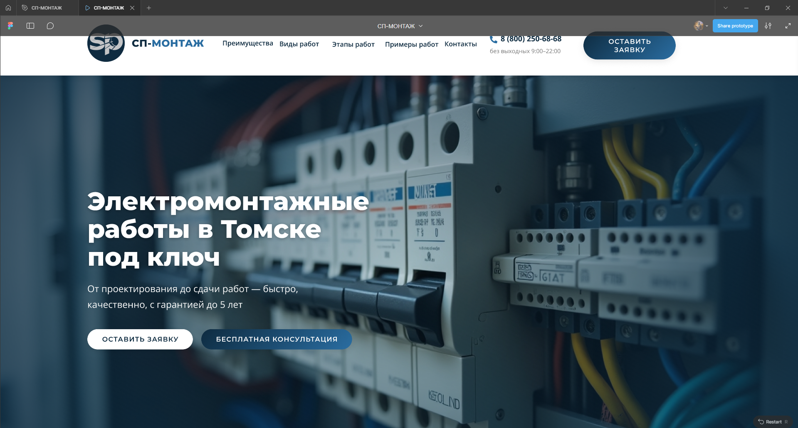
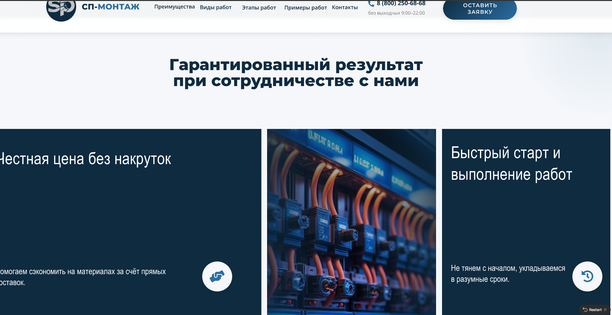
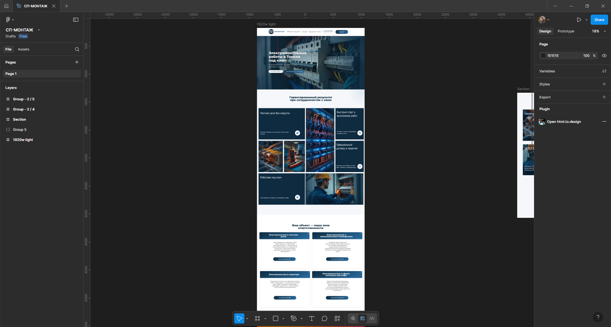

# Дизайн проекта "Электромонтажные работы в Томске под ключ"

## Авторский дизайн-концепт

Создал современный визуальный стиль для компании, специализирующейся на электромонтажных работах под ключ в Томске. Дизайн отражает профессионализм и надежность услуг.

### Ключевые особенности дизайна:

1. **Фирменная цветовая гамма**  
   Основная палитра: глубокий синий (#0E2B40) и насыщенный голубой (#2A6DA1)  
   - #0E2B40 (темно-синий) - символизирует надежность и профессионализм  
   - #2A6DA1 (голубой) - ассоциируется с электричеством и энергией  

2. **Техническая эстетика**  
   - Использовал элементы, напоминающие электрические схемы и монтажные чертежи  
   - Четкие геометрические формы подчеркивают точность работы  
   - Строгие линии и углы отражают техническую направленность  

3. **Информационная иерархия**  
   Разработал понятную структуру подачи информации

## Визуальные материалы

[]  
[]  
[]

## Особенности моего подхода

1. **Акцент на доверии**  
   Через дизайн передал ощущение надежности и безопасности - ключевые факторы для электромонтажных работ.

2. **Локализация**  
   Учитывал специфику Томска - включил узнаваемые элементы городской архитектуры в дизайн.

3. **Функциональность**  
   Все элементы интерфейса разработаны с учетом потребностей целевой аудитории:
   - Четкие призывы к действию  
   - Удобные формы заявок  
   - Быстрый доступ к контактам  

4. **Уникальные графические решения**  
   Создал собственные:  
   - Иконки электромонтажных работ  
   - Схемы процессов  
   - Визуализации этапов работы  

Дизайн успешно сочетает техническую направленность бизнеса с современными веб-трендами.
